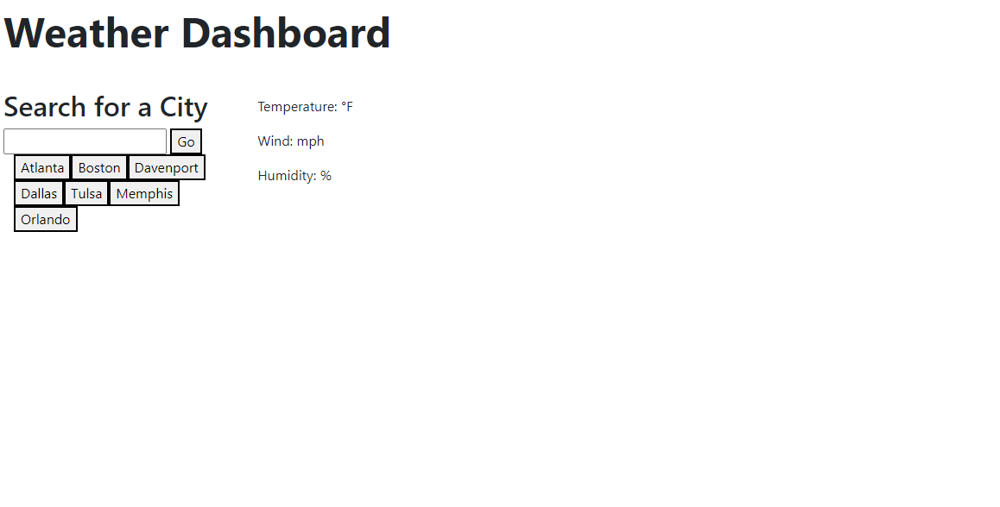
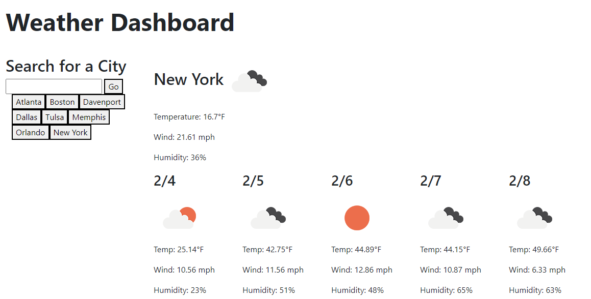

# Weather Dashboard
This website is designed to provide easy-to-find and -read weather information to the user.  

## Directions
Operation of the website is very simple.  Simply enter the city you would like to search for in the search bar, and hit enter!  

Past searches will be saved so that the user can more easily view their city's weather data again.

## Comments and Questions
If you would like to contribute to this project, or have any questions, please send me a direct message on GitHub.

## Contributors
Matt Brandenburgh  [https://github.com/codex-scribe](https://github.com/codex-scribe)

## License
MIT License